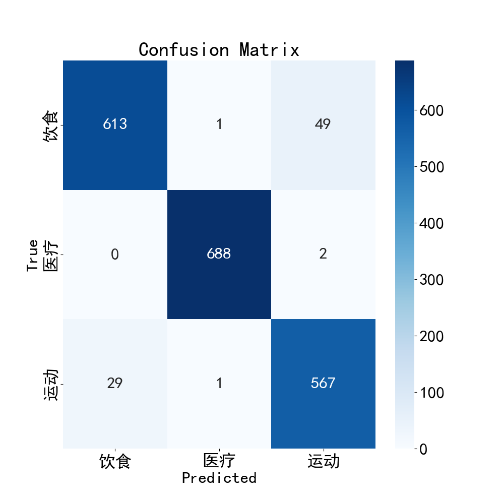

## **Dependencies:**

```
pip install -r requirements.txt
```

---

## **训练:**  
直接运行 `train.py` (不要在命令行里运行，matplotlib会报错)  
参数见 [ClassifierTrainArgs](module/trainer.py) 注释

## **推理:**

示例见 [Inference.py](inference.py)

```python
from module.inference import TextClassifierInference
from module.tokenizer import Tokenizer

if __name__ == '__main__':
    ckpt_path = 'path/to/xxxx.ckpt'
    vocab_dict_path = 'path/to/vocab_dict.json'

    tokenizer = Tokenizer(pad_size=128)
    tokenizer.load_vocab_dict(vocab_dict_path)

    text_classifier = TextClassifierInference(
        ckpt_path=ckpt_path,
        tokenizer=tokenizer
    )
    res = text_classifier.inference("要推断的文本")
    print(res)
```

**Performance:**  


---

**Data:**  
见 [训练数据](data.json) , 可以构建任意类似的数据集进行训练

---

**Watch Logs:**

```
tensorboard --logdir=./output
```

然后打开 [localhost:6006](localhost:6006)
